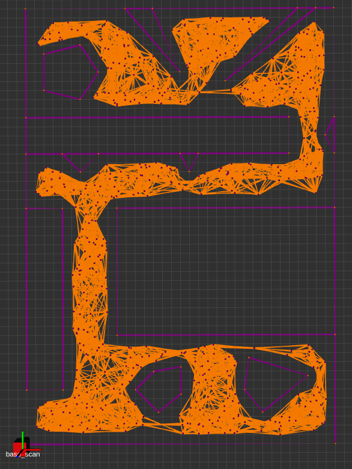
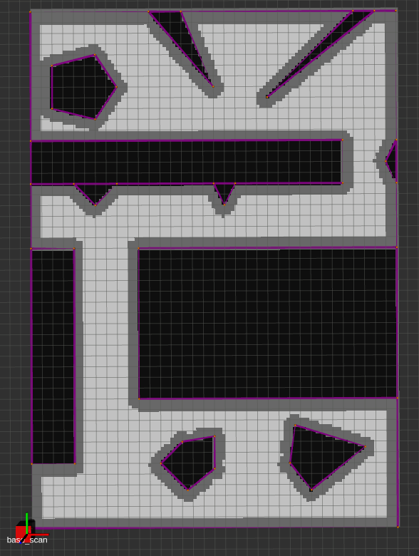

## Motion Planning Library with ROS

Self-directed independent study.

Completed:

* The `map` package:
	- Probabilistic Roadmap

	

	- Tunable-resolution Grid Map

	

In progress:

* Global planners:
	- A* on PRM, Incremental Phi* on Grid, Potential Fields on Grid
* Local planner:
	- Dynamic Window Approach
* Trajectory Optimization:
	- Model Predictive Integral Control

