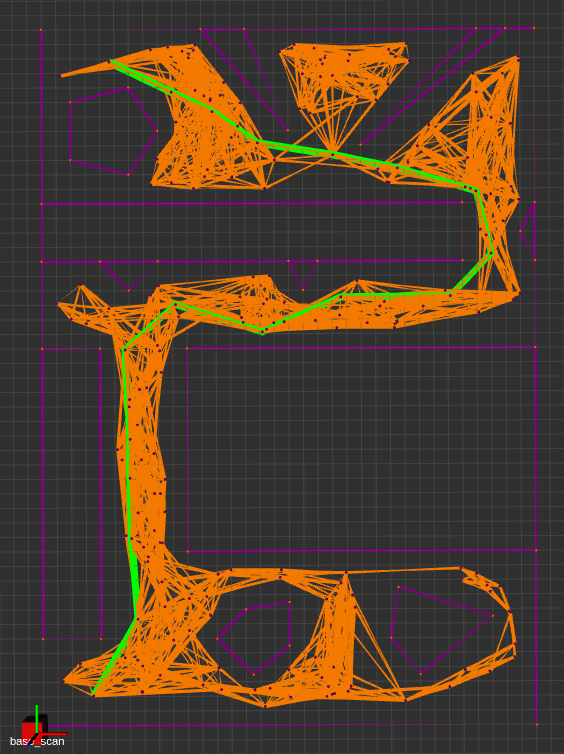
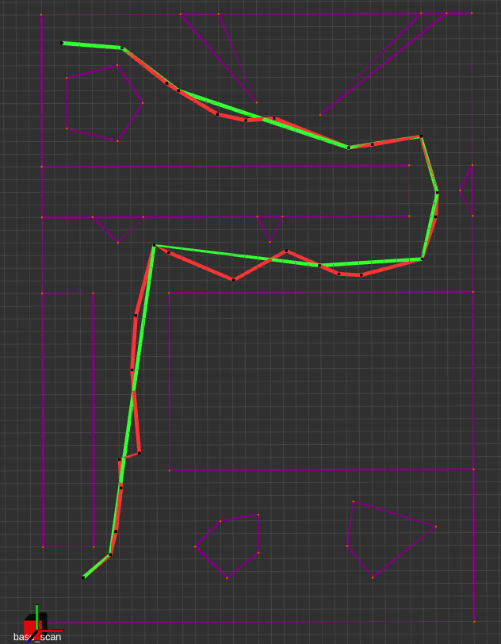
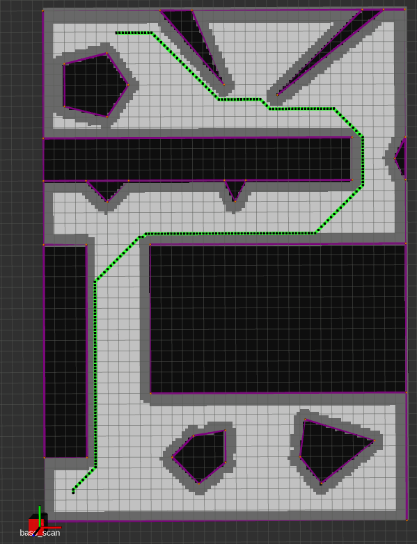
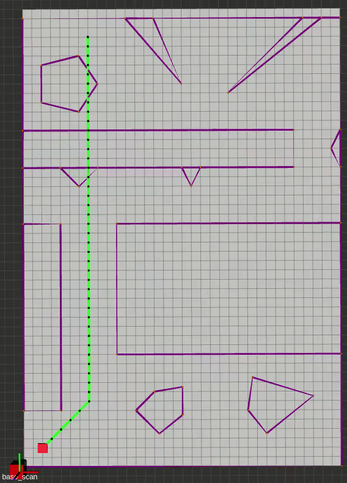
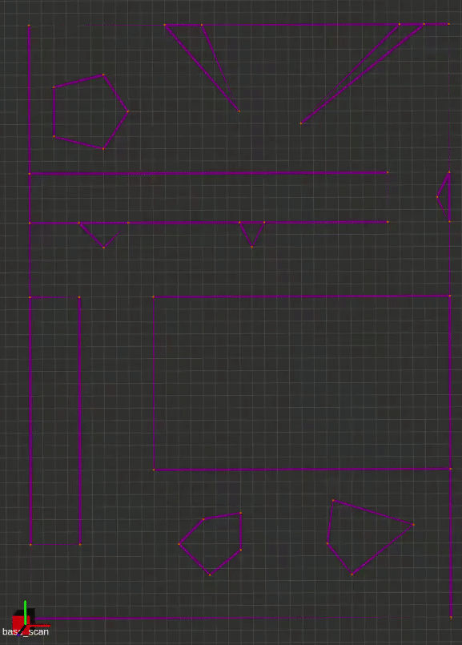
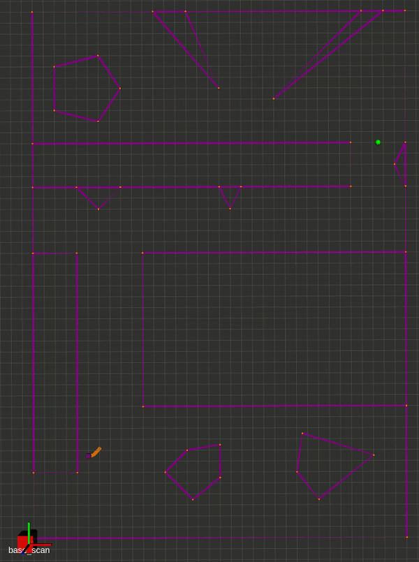
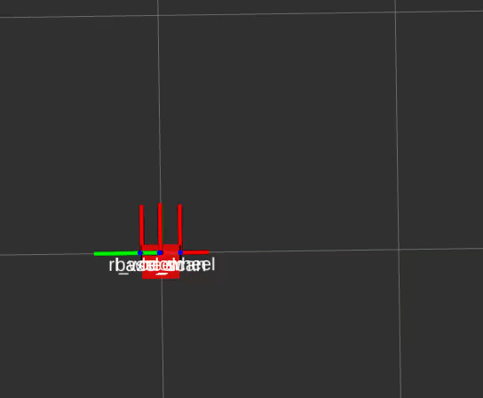
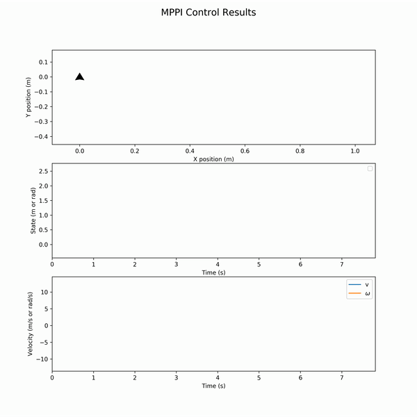

## Motion Planning Library with ROS

Self-directed independent study.

### Installation Guide:
- Make a ROS Workspace: `mkdir -p ws/src`
- Go to `src` and clone my repo: `cd ws/src/` `git clone git@github.com:moribots/motion_planning.git`
- Go back to the workspace root: `cd ..`
- Initialize `nuturtle.rosinstall` to get my rigid2d library and other utilities: `wstool init src src/motion_planning/nuturtle.rosinstall`
- Build the workspace: `catkin_make` and source: `source devel/setup.bash`

### OSQP and OSQP-Eigen installation
[OSQP](https://osqp.org/docs/get_started/sources.html)
[OSQP-Eigen (C++ wrapper)](https://github.com/robotology/osqp-eigen) - Do the manual install.

Notes for OSQP-Eigen:
- Choose `/usr/local` in `cmake -DCMAKE_INSTALL_PREFIX:PATH=<custom-folder> ../`
- Do `sudo ln -s /usr/include/eigen3/Eigen /usr/local/include/Eigen` to make a symbolic link for the Eigen header files so that OSQP-Eigen knows where to find them.

### In this Repo:
* The `map` package: `roslaunch map viz_map.launch`
	- Probabilistic Roadmap:

	

	- Tunable-resolution Grid Map

	

* The `global_planner` package:
	- A* (green) on PRM:

	

	- Theta* (green) on PRM (A* in red for comparison): `roslaunch global_planner astar.launch`

	

	- A* (green) on Grid

	

	- LPA* with Simulated Grid Updates [re-evaluated cells in orange]: `roslaunch global_planner incremental.launch lpa:=True`
	

	- D* Lite on Grid [re-evaluated cells in orange]: `roslaunch global_planner incremental.launch`
	

	- Naive Potential Field (Local Minimum Escape TBD): `roslaunch global_planner potential_field.launch`
	

<!-- * Local planner:
	- Dynamic Window Approach -->
* Trajectory Optimization:
	- Model Predictive Path Integral Control on a parallel parking task: `roslaunch control mppi_pentagon.launch parallel:=True`
	

	- The associated states and controls for the above demo:
	

	NOTE: To launch waypoint following method, simply don't include the `parallel` argument.

	In a separate terminal, do:

	`rosservice call /set_pose "x: 0.0
	y: 0.0
	theta: 0.0"`

	To start the node.

